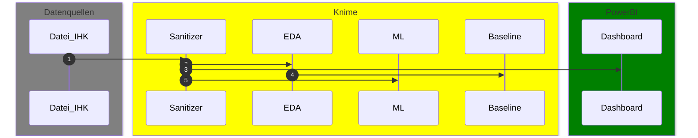
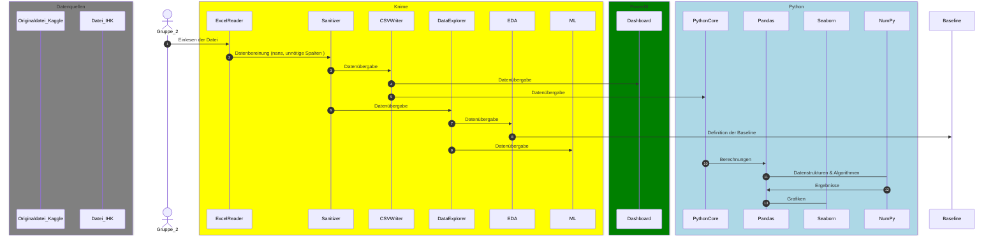

# Projekt <br><i>Burnout der Arbeiterschaft, <br>Vorhersage von Burnout bei Arbeitnehmern</i>
- Prosa folgt 

## Datenprozessierung

Die Daten der ursprünglichen auf [Kaggle](https://www.kaggle.com/datasets/blurredmachine/are-your-employees-burning-out?select=train.csv) publizierten Umfrage wurden als Excel-Datei von der IHK München zur Verfügung gestellt.

Hierbei wurde die Spalte <var>Burn Rate</var> bereits aus der Ursprungsdatei bereits kategorisiert als <var>Burn Risk</var>:

- <var>1</var> = <i>Hohes Risiko für Burnout</i> (```>75%``` Risiko) und 
- <var>0</var> = <i>Kein Hohes Risiko für Burnout</i> (```<=75%``` Risiko).

### Projektfluß (sehr grob)



### Überblick Datenprozessierung (grob)



### Detailsicht auf EDA

- tbd
- => Baseline Score: 

### ML-Modelle

Die erstellten ML-Modelle werden [hier](ml_models.md) detailliert beschrieben.