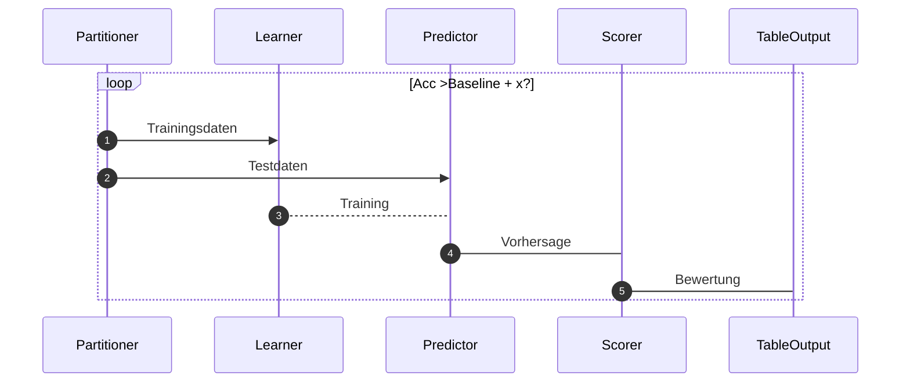

# Projekt  <i>Burnout der Arbeiterschaft,  Vorhersage von Burnout bei Arbeitnehmern</i>

## Detailsicht auf ML

Aus dem Bereich des Machine Learning wurden Modelle benutzt, die:

- [Regression](https://de.wikipedia.org/wiki/Regressionsanalyse), oder 
- [Klassifikation](https://de.wikipedia.org/wiki/Klassifikation) nutzen, oder
- beides kombinieren

Die benutzten Machine Learning Modelle werden im folgenden beschrieben - die generelle Arbeitsweise ist: 

### Linear Regression
-tbd

### K-Nearest Neighbors
-tbd

### Random Forest

-tbd
### Gradient Boosting

-tbd